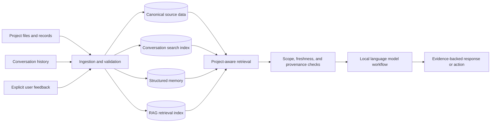

# Local AI, RAG, and Project Memory

> Personal project case study. This repository documents the architecture and engineering approach; private implementation details and environment-specific configuration are intentionally excluded.

## Overview

This project explores how local language models can work with long-lived project knowledge without treating an entire conversation history as one undifferentiated prompt. The system combines Retrieval-Augmented Generation (RAG), structured memory, searchable conversation history, and project-aware context controls.

The goal is practical: retrieve the right evidence for the current task, preserve its origin, and prevent unrelated projects or stale information from being mixed into an answer.

## The problem

Long-running technical projects produce many different kinds of information:

- Source documents and operational records
- Conversations and decisions
- Durable facts and preferences
- Temporary working context
- Procedures, tasks, and future intentions
- Derived search indexes and summaries

Putting everything into one store makes retrieval noisy and creates provenance, freshness, and project-isolation risks. This project separates those responsibilities while providing one retrieval workflow for the user.

## Architecture

Each layer has a distinct purpose:

- **Canonical sources** remain the authority for project facts.
- **Conversation search** supports retrieval of relevant historical discussions.
- **Structured memory** stores durable facts, relationships, confidence, and temporal context.
- **RAG indexes** provide semantic retrieval over approved material.
- **Project-aware controls** filter results before they reach the model.

## Engineering highlights

### Project isolation

Retrieval begins with a resolved project identity. Similar filenames, matching terminology, or shared technologies are not enough to mix information across projects. Cross-project relationships must be explicit and evidence-backed.

### Provenance and temporal context

Memories retain their source, observation time, confidence, and validity information. Corrections preserve history instead of silently overwriting the previous claim.

### Rebuildable derived data

Indexes, caches, and summaries are treated as derived state. They can be rebuilt from canonical sources, making maintenance safer and easier to audit.

### Local-first operation

Local models and embeddings are used for bounded retrieval and analysis workflows. Sensitive material remains within the controlled environment, and generated output is treated as advisory until verified.

### Automation and health checks

Scheduled processes detect changes, refresh indexes, validate references, and report failures. Ambiguous project identity or missing evidence is quarantined instead of being silently accepted.

## My contribution

- Designed the layered memory and retrieval architecture.
- Built Python and SQLite components for structured storage and search.
- Developed project-scoping, provenance, and validation rules.
- Integrated local language models and embeddings through Ollama.
- Added automated project discovery, indexing, maintenance, and health reporting.
- Created tests for isolation, persistence, retrieval behavior, and safe repair.

## Technologies

`Python` · `SQLite` · `Ollama` · `RAG` · `Embeddings` · `Local LLMs` · `Bash` · `systemd` · `Git` · `JSON`

## What I learned

- Retrieval quality depends as much on scope and provenance as semantic similarity.
- Conversation recency does not guarantee relevance or correctness.
- Structured memory, full-text conversation search, and vector retrieval solve different problems.
- Derived state should be rebuildable, while canonical evidence remains protected.
- AI-generated conclusions still require deterministic validation for operational work.

## Public scope

This case study describes the system at an architectural level. It does not publish private conversations, local paths, credentials, infrastructure access details, or proprietary project data.

Back to [Russell Bukowski's GitHub profile](https://github.com/russellbukowski).
